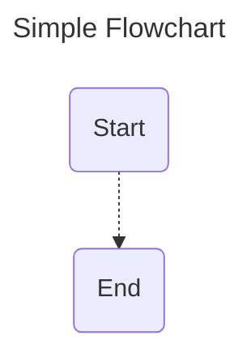

<head>
<meta name="google-site-verification" content="j94IkHu19Am6TroNXqgXc1AnHUZ5oJdIR_xoZB8yI88" />
</head>

# Go-Mermaid


[](https://raw.githack.com/wiki/TyphonHill/go-mermaid/coverage.html)

Go-Mermaid is an open-source Go language (Golang) project designed to streamline and automate the creation of Mermaid diagrams.  
Mermaid is a popular diagramming and charting tool that uses a simple and intuitive text-based syntax to generate a wide variety of diagrams, including flowcharts, sequence diagrams, Gantt charts, and more.

Go-Mermaid is tailored for automation and batch diagram generation, making it an ideal choice for projects where numerous diagrams need to be created or updated consistently. Whether you're a developer, a system architect, or a documentation enthusiast, Go-Mermaid empowers you to automate the creation of Mermaid diagrams with efficiency and precision.

## Instalation

`go get -u github.com/TyphonHill/go-mermaid`

### Example

All examples are available [here](https://github.com/TyphonHill/go-mermaid/blob/main/examples)

```go
package main

import (
    "fmt"

    "github.com/TyphonHill/go-mermaid/flowchart"
)

func main() {
    fc := flowchart.NewFlowchart()
    fc.Title = "Simple Flowchart"

    node1 := fc.AddNode("Start")
    node2 := fc.AddNode("End")

    link := fc.AddLink(node1, node2)
    link.Shape = flowchart.LinkShapeDotted

    fmt.Println(fc.String())
}
```

The example above creates the following diagram:



### Roadmap

Implement support for other Mermaid diagram types:

- [x] [Flowchart](https://mermaid.js.org/syntax/flowchart.html)
- [x] [Class Diagram](https://mermaid.js.org/syntax/classDiagram.html)
- [x] [Sequence Diagram](https://mermaid.js.org/syntax/sequenceDiagram.html)
- [x] [State Diagram](https://mermaid.js.org/syntax/stateDiagram.html)
- [x] [Entity Relationship Diagrams](https://mermaid.js.org/syntax/entityRelationshipDiagram.html)
- [x] [User Journey Diagram](https://mermaid.js.org/syntax/userJourney.html)
- [x] [Timeline Diagram](https://mermaid.js.org/syntax/timeline.html)
- [x] [Block Diagram](https://mermaid.js.org/syntax/block.html)
- [ ] [Gantt Diagram](https://mermaid.js.org/syntax/gantt.html)
- [ ] [Pie Chart](https://mermaid.js.org/syntax/pie.html)
- [ ] [Quadrant Chart](https://mermaid.js.org/syntax/quadrantChart.html)
- [ ] [Requirement Diagram](https://mermaid.js.org/syntax/requirementDiagram.html)

Mermaid supports other diagram types that are currently marked as "experimental" and as such, are subject to change. Once these diagrams leave the experimental phase, they can be added to the list above.

### Contribute

Want to help? Found a bug?

1. Do not hesitate to fork the repository and send PRs with your changes
2. No time to code? Open a bug/feature issue
