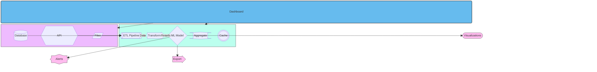

```mermaid
block-beta
	columns 4
	0("Dashboard"):4
	style 0 fill:#6BE,stroke:#333,stroke-width:2px
	style 0 fill:#6BE,stroke:#333,stroke-width:2px
	block:1:1
		2[("Database")]
		3{{"API"}}
		4[/"Files"/]
	end
	style 1 fill:#EBF,stroke:#333
	style 1 fill:#EBF,stroke:#333
	block:5:1
		6[["ETL Pipeline"]]
		7<["Transform"]>(right)
		8{"ML Model"}
		9<["Aggregate"]>(up, down)
		10((("Cache")))
	end
	style 5 fill:#BFE,stroke:#333
	style 5 fill:#BFE,stroke:#333
	space
	11(["Visualizations"]):2
	style 11 fill:#FBE,stroke:#333
	style 11 fill:#FBE,stroke:#333
	12<["Alerts"]>(x, y)
	style 12 fill:#FBE,stroke:#333
	style 12 fill:#FBE,stroke:#333
	13<["Export"]>(right)
	style 13 fill:#FBE,stroke:#333
	style 13 fill:#FBE,stroke:#333
	0 --> 1
	0 --> 5
	2 --> 6
	3 --> 6
	4 --> 6
	6 -- "Data" --> 7
	7 -- "Results" --> 8
	8 --> 11
	8 --> 12
	8 --> 13
```
