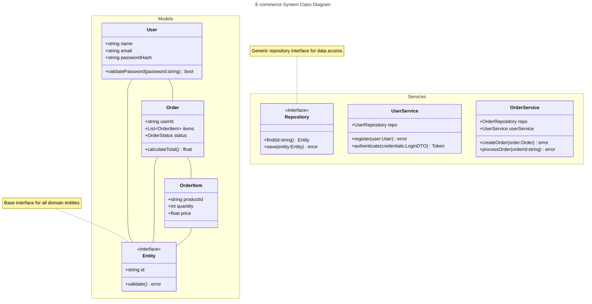

```mermaid
---
title: E-commerce System Class Diagram
config:
    theme: default
    maxTextSize: 50000
    maxEdges: 500
    fontSize: 16
---
classDiagram
    direction TB
    note for Entity "Base interface for all domain entities"
    note for Repository "Generic repository interface for data access"
    namespace Models{
        class Entity{
        <<Interface>>
            +string id
            +validate() error
        }
        class User{
            +string name
            +string email
            +string passwordHash
            +validatePassword(password:string) bool
        }
        class Order{
            +string userId
            +List~OrderItem~ items
            +OrderStatus status
            +calculateTotal() float
        }
        class OrderItem{
            +string productId
            +int quantity
            +float price
        }
    }
    namespace Services{
        class Repository{
        <<Interface>>
            +find(id:string) Entity
            +save(entity:Entity) error
        }
        class UserService{
            +UserRepository repo
            +register(user:User) error
            +authenticate(credentials:LoginDTO) Token
        }
        class OrderService{
            +OrderRepository repo
            +UserService userService
            +createOrder(order:Order) error
            +processOrder(orderId:string) error
        }
    }
    User -- Entity
    Order -- Entity
    OrderItem -- Entity
    Order -- OrderItem
    User -- Order

```
