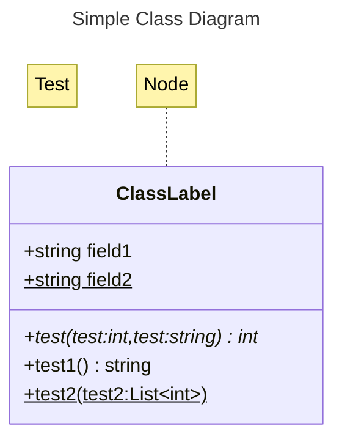

# Simple Class Diagram

```mermaid
---
title: Simple Class Diagram
---

classDiagram
    direction TB
    note "Test"
    note for Class "Node"
    class Class["ClassLabel"]{
        +string field1
        +string field2$
        +test(test:int,test:string)* int
        +test1() string
        +test2(test2:List~int~)$ 
    }
```
