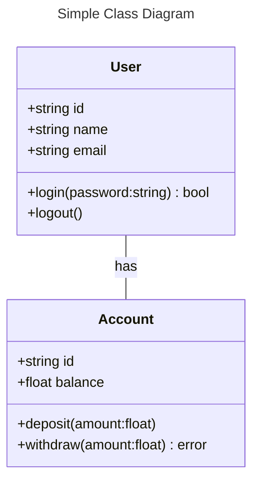

```mermaid
---
title: Simple Class Diagram
config:
    theme: default
    maxTextSize: 50000
    maxEdges: 500
    fontSize: 16
---
classDiagram
    direction TB
    class User{
        +string id
        +string name
        +string email
        +login(password:string) bool
        +logout() 
    }
    class Account{
        +string id
        +float balance
        +deposit(amount:float) 
        +withdraw(amount:float) error
    }
    User -- Account : has

```
