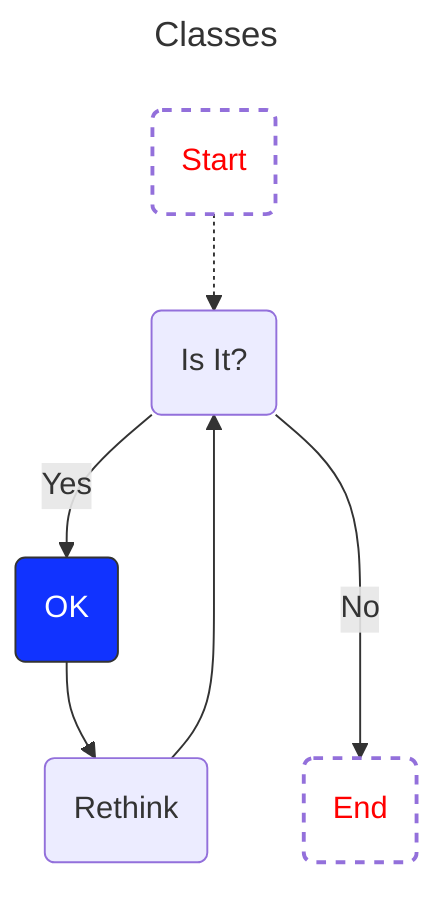

# Classes

```mermaid
---
title: Classes
---

flowchart TB
    classDef Class1 color:red,fill:white,stroke-width:2,stroke-dasharray:5
    classDef Class2 color:white,fill:#13f,stroke:#333,stroke-width:1,stroke-dasharray:0
    0("Start"):::Class1
    1("Is It?")
    2("OK"):::Class2
    3("Rethink")
    4("End"):::Class1
    0 -.-> 1
    1 -->|Yes| 2
    2 --> 3
    3 --> 1
    1 --->|No| 4
```
