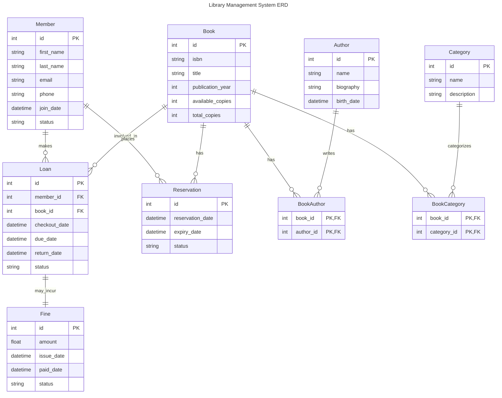

```mermaid
---
title: Library Management System ERD
---

erDiagram
	MEMBERS [Member] {
		int id PK
		string first_name
		string last_name
		string email
		string phone
		datetime join_date
		string status
	}
	BOOKS [Book] {
		int id PK
		string isbn
		string title
		int publication_year
		int available_copies
		int total_copies
	}
	AUTHORS [Author] {
		int id PK
		string name
		string biography
		datetime birth_date
	}
	CATEGORIES [Category] {
		int id PK
		string name
		string description
	}
	LOANS [Loan] {
		int id PK
		int member_id FK
		int book_id FK
		datetime checkout_date
		datetime due_date
		datetime return_date
		string status
	}
	FINES [Fine] {
		int id PK
		float amount
		datetime issue_date
		datetime paid_date
		string status
	}
	RESERVATIONS [Reservation] {
		int id PK
		datetime reservation_date
		datetime expiry_date
		string status
	}
	BOOK_AUTHORS [BookAuthor] {
		int book_id PK,FK
		int author_id PK,FK
	}
	BOOK_CATEGORIES [BookCategory] {
		int book_id PK,FK
		int category_id PK,FK
	}

	MEMBERS ||--o{ LOANS : makes
	BOOKS ||--o{ LOANS : involved_in
	LOANS ||--|| FINES : may_incur
	MEMBERS ||--o{ RESERVATIONS : places
	BOOKS ||--o{ RESERVATIONS : has
	BOOKS ||--o{ BOOK_AUTHORS : has
	AUTHORS ||--o{ BOOK_AUTHORS : writes
	BOOKS ||--o{ BOOK_CATEGORIES : has
	CATEGORIES ||--o{ BOOK_CATEGORIES : categorizes
```
