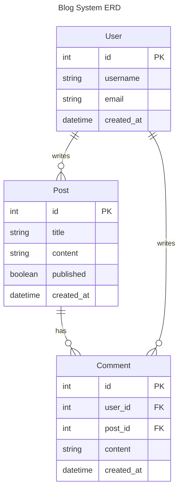

```mermaid
---
title: Blog System ERD
---

erDiagram
	USER_TABLE [User] {
		int id PK
		string username
		string email
		datetime created_at
	}
	POSTS [Post] {
		int id PK
		string title
		string content
		boolean published
		datetime created_at
	}
	COMMENTS [Comment] {
		int id PK
		int user_id FK
		int post_id FK
		string content
		datetime created_at
	}

	USER_TABLE ||--o{ POSTS : writes
	POSTS ||--o{ COMMENTS : has
	USER_TABLE ||--o{ COMMENTS : writes

```
