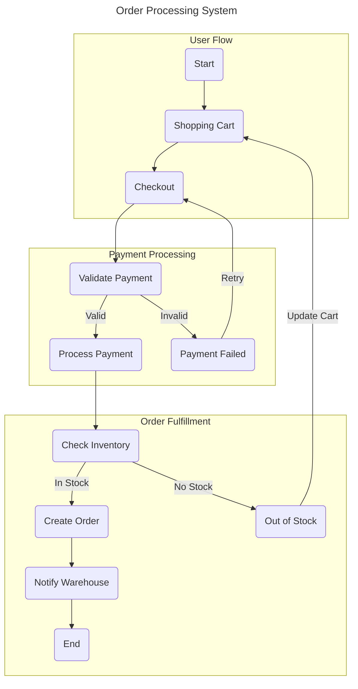

```mermaid
---
title: Order Processing System
---

flowchart TB
	0("Start")
	1("Shopping Cart")
	2("Checkout")
	3("Validate Payment")
	4("Process Payment")
	5("Payment Failed")
	6("Check Inventory")
	7("Create Order")
	8("Notify Warehouse")
	9("Out of Stock")
	10("End")
	subgraph 11 [User Flow]
		0 --> 1
		1 --> 2
	end
	subgraph 12 [Payment Processing]
		2 --> 3
		3 -->|Valid| 4
		3 -->|Invalid| 5
		5 -->|Retry| 2
	end
	subgraph 13 [Order Fulfillment]
		4 --> 6
		6 -->|In Stock| 7
		6 -->|No Stock| 9
		7 --> 8
		8 --> 10
		9 -->|Update Cart| 1
	end
```
