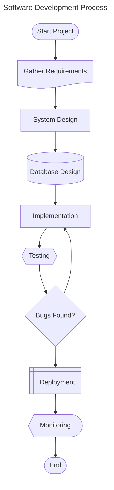

```mermaid
---
title: Software Development Process
---

flowchart TB
	0@{ shape: stadium, label: "Start Project"}
	1@{ shape: doc, label: "Gather Requirements"}
	2@{ shape: rect, label: "System Design"}
	3@{ shape: cyl, label: "Database Design"}
	4@{ shape: rect, label: "Implementation"}
	5@{ shape: hex, label: "Testing"}
	6@{ shape: diam, label: "Bugs Found?"}
	7@{ shape: win-pane, label: "Deployment"}
	8@{ shape: curv-trap, label: "Monitoring"}
	9@{ shape: stadium, label: "End"}
	0 --> 1
	1 --> 2
	2 --> 3
	3 --> 4
	4 --> 5
	5 --> 6
	6 --> 4
	6 --> 7
	7 --> 8
	8 --> 9
```
