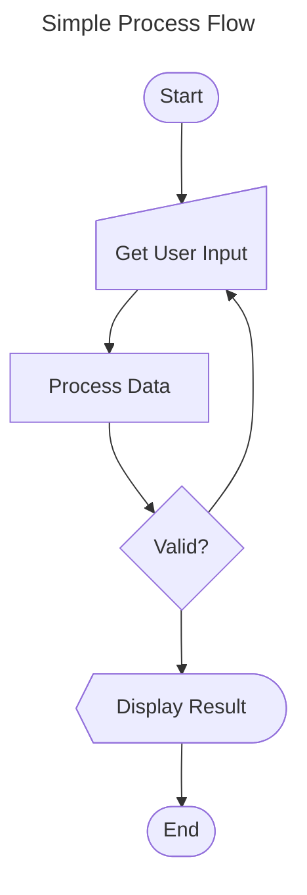

```mermaid
---
title: Simple Process Flow
---

flowchart TB
	0@{ shape: stadium, label: "Start"}
	1@{ shape: sl-rect, label: "Get User Input"}
	2@{ shape: rect, label: "Process Data"}
	3@{ shape: diam, label: "Valid?"}
	4@{ shape: curv-trap, label: "Display Result"}
	5@{ shape: stadium, label: "End"}
	0 --> 1
	1 --> 2
	2 --> 3
	3 --> 4
	3 --> 1
	4 --> 5
```
