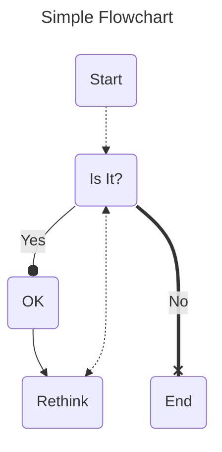

# Simple Flowchart

```mermaid
---
title: Simple Flowchart
---

flowchart TB
    0("Start")
    1("Is It?")
    2("OK")
    3("Rethink")
    4("End")
    0 -.-> 1
    1 --o|Yes| 2
    2 --> 3
    3 <-.-> 1
    1 ===x|No| 4
```
