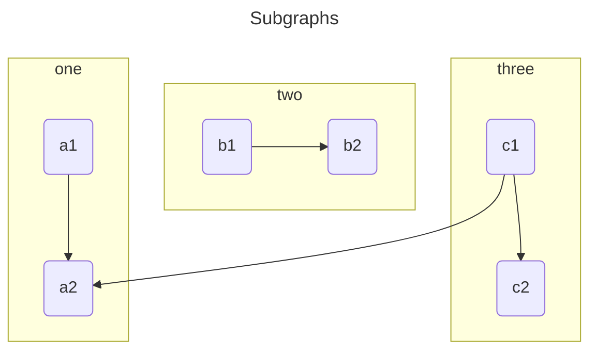

# Subgraphs

```mermaid
---
title: Subgraphs
---

flowchart TB
    0("a1")
    1("a2")
    2("b1")
    3("b2")
    4("c1")
    5("c2")
    subgraph 6 [one]
        0 --> 1
    end
    subgraph 7 [two]
        2 --> 3
    end
    subgraph 8 [three]
        4 --> 5
        4 --> 1
    end
```
