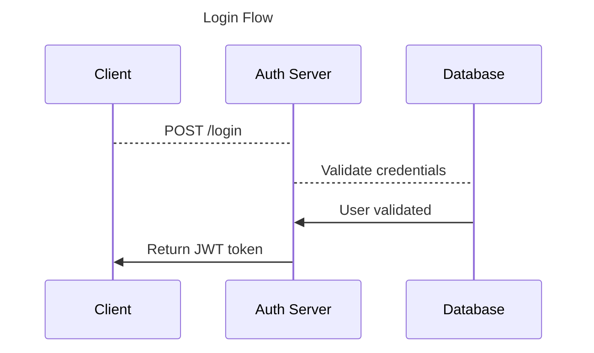

```mermaid
---
title: Login Flow
config:
    theme: default
    maxTextSize: 50000
    maxEdges: 500
    fontSize: 16
---
sequenceDiagram
    participant client as Client
    participant server as Auth Server
    participant db as Database
	client-->server: POST /login
		server-->db: Validate credentials
			db->>server: User validated
	server->>client: Return JWT token

```
