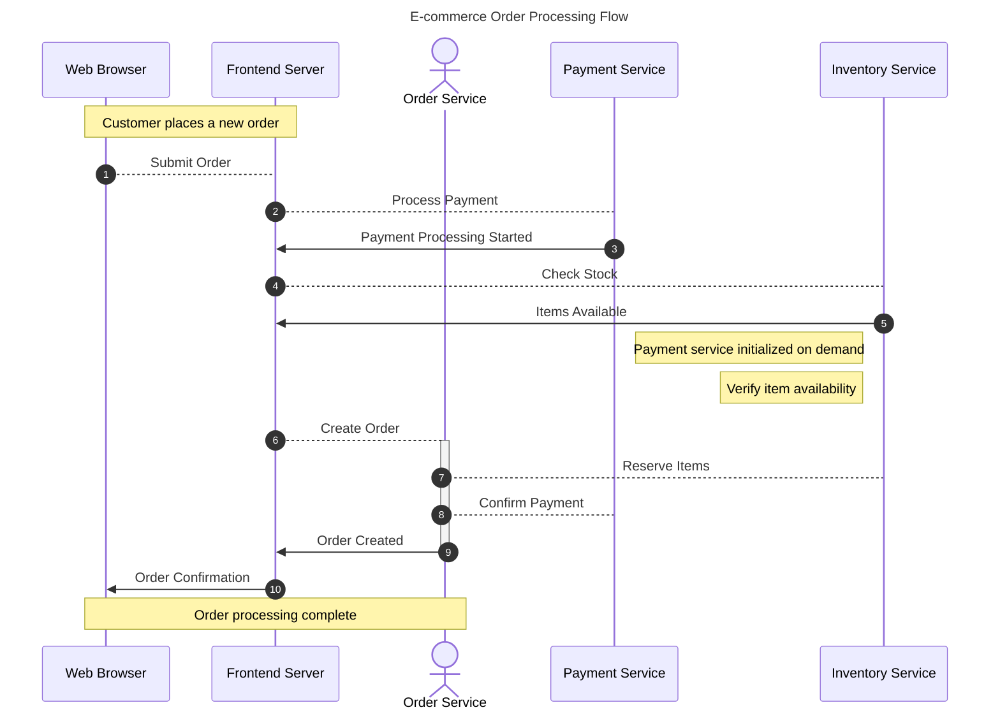

```mermaid
---
title: E-commerce Order Processing Flow
---

sequenceDiagram
autonumber
        participant browser as Web Browser
        participant frontend as Frontend Server
        actor orders as Order Service
        participant payment as Payment Service
        participant inventory as Inventory Service
        Note over browser,frontend: Customer places a new order
        browser-->frontend: Submit Order
                frontend-->payment: Process Payment
                        payment->>frontend: Payment Processing Started
                frontend-->inventory: Check Stock
                        inventory->>frontend: Items Available
        Note right of payment: Payment service initialized on demand
        Note left of inventory: Verify item availability
        frontend-->orders: Create Order
        activate orders
                orders-->inventory: Reserve Items
                orders-->payment: Confirm Payment
        orders->>frontend: Order Created
        deactivate orders
        frontend->>browser: Order Confirmation
        destroy payment
        Note over browser,orders: Order processing complete
```