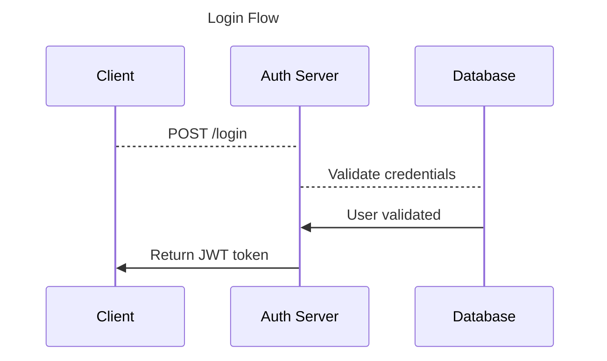

```mermaid
---
title: Login Flow
---

sequenceDiagram
	participant client as Client
	participant server as Auth Server
	participant db as Database
	client-->server: POST /login
		server-->db: Validate credentials
			db->>server: User validated
	server->>client: Return JWT token
```
