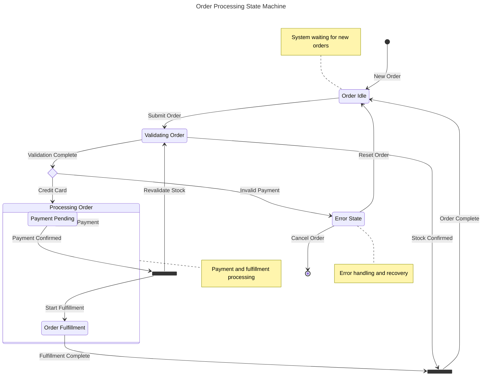

```mermaid
---
title: Order Processing State Machine
---

stateDiagram-v2
	state "Order Idle" as idle
	note left of idle: System waiting for new orders
	state "Validating Order" as validating
	state "Processing Order" as processing
	state processing {
    	state "Payment Pending" as payment_pending
    	state "Order Fulfillment" as fulfillment
	}
	note right of processing: Payment and fulfillment processing
	state "Error State" as error
	note right of error: Error handling and recovery
	state decision <<choice>>
	state fork <<fork>>
	state join <<join>>
	[*] --> idle: New Order
	idle --> validating: Submit Order
	validating --> decision: Validation Complete
	decision --> processing: Credit Card
	decision --> error: Invalid Payment
	processing --> payment_pending: Process Payment
	payment_pending --> fork: Payment Confirmed
	fork --> fulfillment: Start Fulfillment
	fork --> validating: Revalidate Stock
	fulfillment --> join: Fulfillment Complete
	validating --> join: Stock Confirmed
	join --> idle: Order Complete
	error --> idle: Reset Order
	error --> [*]: Cancel Order

```
