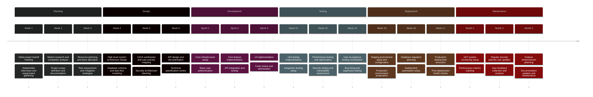

```mermaid
---
title: Software Development Lifecycle
config:
    theme: dark
    themeVariables:
        fontFamily: Arial
        darkMode: false
    maxTextSize: 50000
    maxEdges: 500
    fontSize: 16
---
timeline
    section Planning
        Week 1
        : Initial project kickoff meeting
        : Stakeholder interviews and requirement gathering
        Week 2
        : Market research and competitor analysis
        : Project scope definition and documentation
        Week 3
        : Resource planning and team allocation
        : Risk assessment and mitigation strategies
    section Design
        Week 4
        : High-level system architecture design
        : Database schema and data flow modeling
        Week 5
        : UI/UX wireframes and user journey mapping
        : Security architecture planning
        Week 6
        : API design and documentation
        : Technical specification review
    section Development
        Sprint 1
        : Core infrastructure setup
        : Basic user authentication
        Sprint 2
        : Core feature implementation
        : API integration and testing
        Sprint 3
        : UI implementation
        : Code review and optimization
    section Testing
        Week 12
        : Unit testing implementation
        : Integration testing setup
        Week 13
        : Performance testing and optimization
        : Security testing and vulnerability assessment
        Week 14
        : User acceptance testing coordination
        : Bug fixing and regression testing
    section Deployment
        Week 15
        : Staging environment setup and configuration
        : Production environment preparation
        Week 16
        : Database migration planning
        : Deployment automation setup
        Week 17
        : Production deployment execution
        : Post-deployment health checks
    section Maintenance
        Month 1
        : 24/7 system monitoring setup
        : Performance metrics tracking
        Month 2
        : Regular security patches and updates
        : User feedback collection and analysis
        Month 3
        : Feature enhancement planning
        : Documentation updates and maintenance

```
