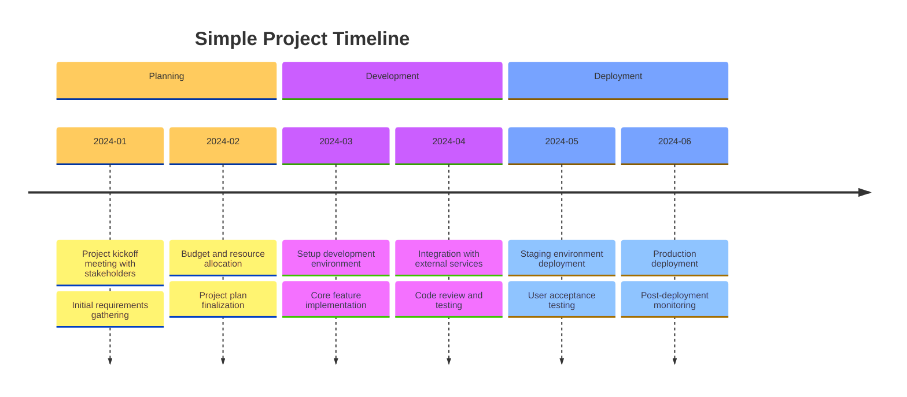

```mermaid
%%{init: { 'theme': 'base', 'timeline': {'disableMulticolor': true}}}%%
timeline
	title Simple Project Timeline
	section Planning
		2024-01 		: Project kickoff meeting with stakeholders
		: Initial requirements gathering
		2024-02 		: Budget and resource allocation
		: Project plan finalization
	section Development
		2024-03 		: Setup development environment
		: Core feature implementation
		2024-04 		: Integration with external services
		: Code review and testing
	section Deployment
		2024-05 		: Staging environment deployment
		: User acceptance testing
		2024-06 		: Production deployment
		: Post-deployment monitoring

```
